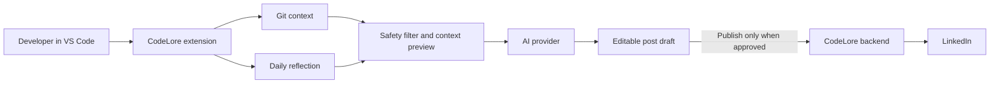

# CodeLore

CodeLore helps developers turn their daily work into a story worth sharing.

It lives in VS Code and helps you reflect on what you built, what you learned, and what you got unstuck on. It can use your Git activity and your own notes to draft a post for LinkedIn or X. You stay in control of the final words and nothing gets posted without you pressing publish.

The goal is simple: building in public should feel like part of the work, not another task waiting at the end of the day.

## What we are building

- A quick daily reflection inside VS Code
- Drafts based on commits, staged changes, or a developer's own notes
- A safe context preview before any code is sent to an AI provider
- A clean place to edit a LinkedIn or X post
- Optional LinkedIn publishing after the user connects their account

## Setup

You will need Node.js, npm, Git, and VS Code.

```bash
git clone git@github.com:toonshi/codelore.git
cd codelore
npm install
code .
```

To run the extension locally, open the Run and Debug view in VS Code and press `F5`. VS Code opens a separate Extension Development Host window. In that window, open the Command Palette and run a CodeLore command.

If you make changes, use the development window's **Developer: Reload Window** command to recieve them.

## Architecture

CodeLore is designed to keep repository context local by default.



The VS Code extension reads the workspace, gathers selected Git context, and creates drafts. The backend is only needed once we add LinkedIn publishing. It handles OAuth securely and stores the user’s publishing connection. It should never need a copy of the user’s repository.

## Privacy principles

- Code is not scanned or sent anywhere without a clear user action.
- Sensitive files such as `.env` files and private keys are excluded by default.
- The user can review the exact context before AI generation.
- Posts are always reviewed before publishing.
- Users can disconnect LinkedIn and delete their connection data.

## Project structure

```text
src/
  extension.ts       Extension entry point
  test/              Extension tests
.vscode/             Debug and task configuration
package.json         VS Code extension manifest and npm scripts
```

## Development commands

```bash
npm run compile
npm run watch
npm test
```

## Status

CodeLore is in early development. Right now, we are building the extension foundation before adding Git analysis, AI drafting, and LinkedIn publishing.

## Contributing

This project is being built in public. Issues, ideas, and honest feedback are welcome.
